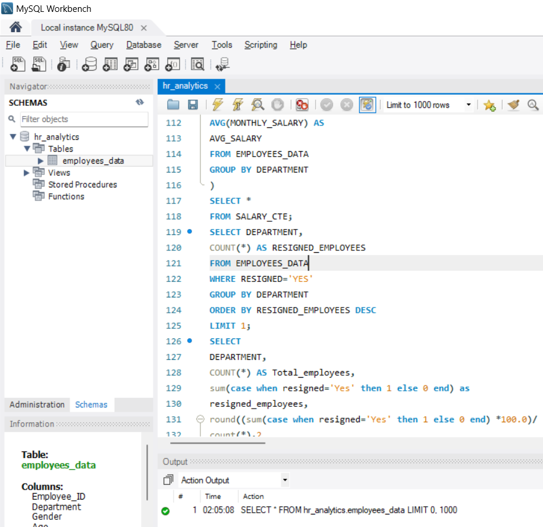
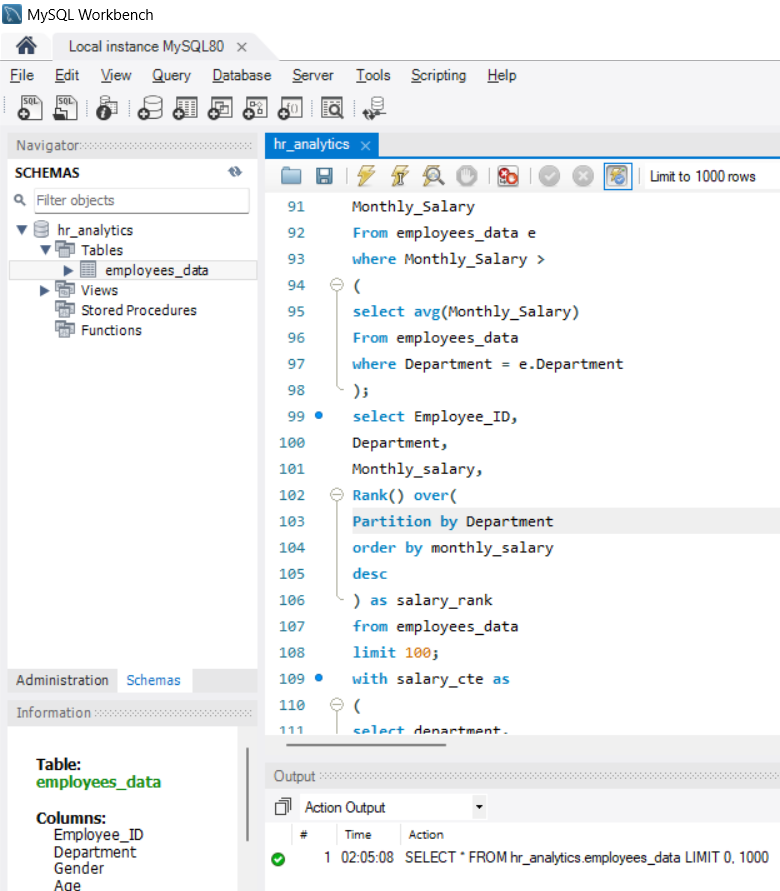
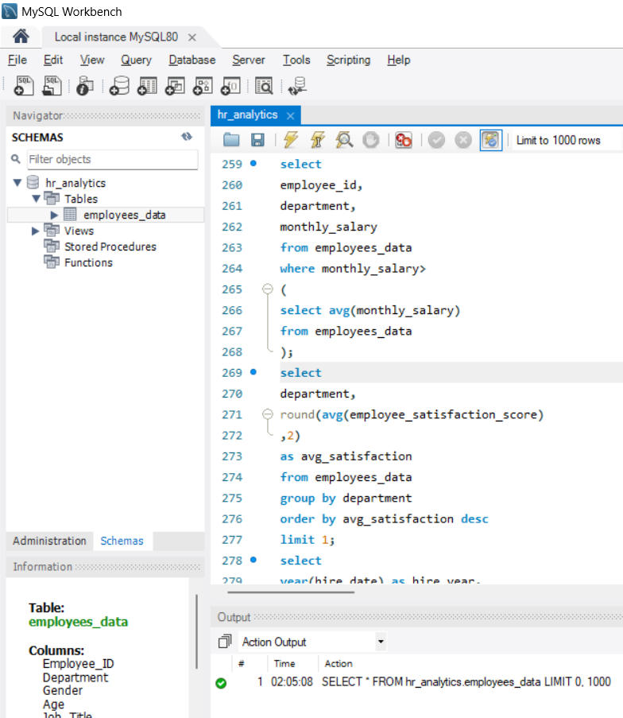
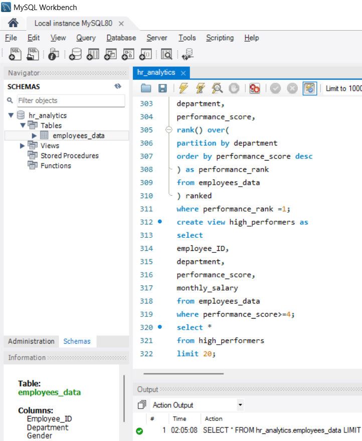

# HR Analytics SQL Project

## Project Overview
This project analyzes employee data using SQL in MySQL Workbench to generate HR and workforce insights.

The analysis focuses on salary trends, employee performance, department-level insights, satisfaction scores, overtime patterns, hiring trends, and high performer identification.

## Tools Used
- MySQL Workbench
- SQL

## Dataset Information
The dataset contains employee-related HR data including:

- Employee ID
- Department
- Salary
- Performance Score
- Satisfaction Score
- Overtime Hours
- Hire Date
- Education Level
- Gender

The dataset was used to perform SQL-based HR analytics and workforce analysis.

## Business Problems Solved
- Identified high-performing employees across departments
- Analyzed salary distribution and departmental trends
- Evaluated employee satisfaction levels
- Tracked workforce hiring patterns
- Created ranking-based employee analysis using window functions

## Advanced SQL Concepts Used
- SELECT statements
- WHERE clause
- GROUP BY
- ORDER BY
- Aggregate functions
- Subqueries
- Window functions
- RANK()
- DENSE_RANK()
- CTEs
- Views

## Key Analysis Performed
- Department-wise salary analysis
- Employee performance ranking
- Workforce satisfaction analysis
- Overtime analysis
- Hiring trend analysis
- High performer identification

## Project Files
- `hr_analytics_queries.sql` - Complete SQL queries
- `screenshots/` - Project screenshots

## Screenshots

### Salary Subquery Analysis

### Employee Salary Ranking

### Department Satisfaction Analysis

### High Performer Analysis

## Sample Insights
- Identified top-performing employees using ranking functions
- Analyzed salary distribution across departments
- Measured average employee satisfaction by department
- Tracked hiring trends by year
- Created a view for high-performing employees

## Author
Seema Metri
